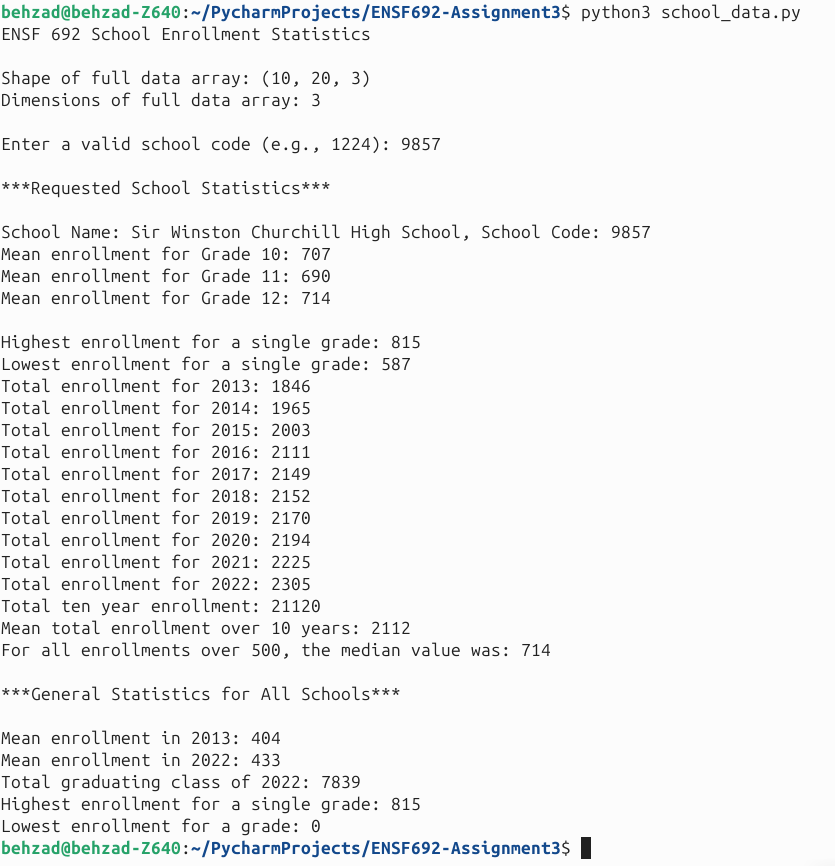

# School Enrollment Statistics (ENSF 692 Assignment 3)

**Author:** Behzad Fuladpanjeh Hojaghan  

## Overview

This is a terminal-based Python application that reads, processes, and displays school enrollment statistics provided for this assignment.
It uses structured data stored in NumPy arrays, and allows users to request specific schools and view general enrollment trends across all schools.

---

## Features

- Loads enrollment data from provided `.py` files (`given_data.py`)
- Loads school names and codes from a CSV file (`Assignment3Data.csv`)
- Uses NumPy to perform statistical calculations: Mean, total, min, max, median 
- Error handling for invalid input

---

## Sample Output

             